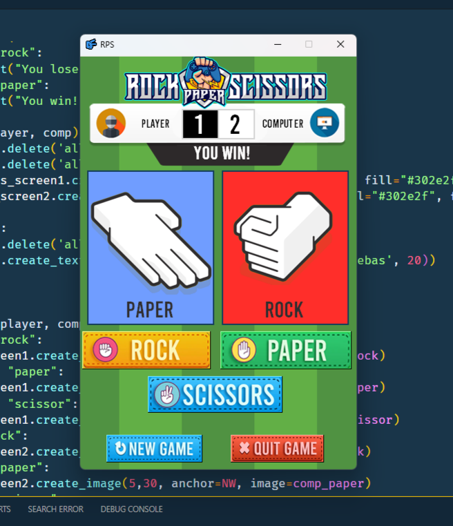

Requirements:

Library:

-Install Python Imaging Library (PIL).
-You can use CMD, terminal in any Text Editor or any IDE. Just paste and enter the command "pip install pillow".

Font:

-Download 'Bebas' font (Regular).

Here is a preview of the Rock-Paper-Scissors game:

